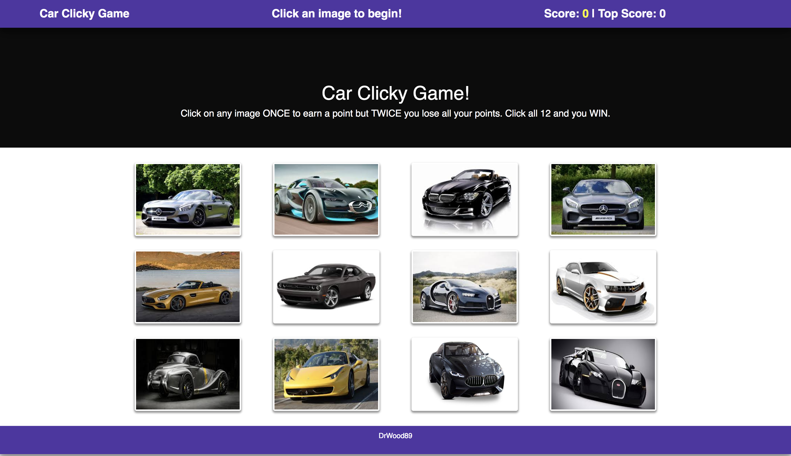

### React Car Clicky Game!
Try to beat your High Score
  
---
## Table of contents
  
### 1-Description
### 2-Technologies
### 3-Challenges
### 4-Issues
### 5-Contributors
### 6-Preview Link

---
### 1-Description

This.app is a basic clikcy game using React. upon starting it requires that you click on an image to get then the images shuffles to random places. The goal is to click on all the cars once otherwise if click on twice then your score restarts.

I have so much fun building this app as React is such a fun tool to use. It allowed me to break my website down into small components that i was able to mount together on my main app.js already function and styled. That way your code is easier to debug, cleaner, simpler so it allows you to work more efficiently.

The construction of this app was mostly to showcase a little of my react skills.

  Here are a few ScreenShots of App working!
  
  

---
### 2-Technologies

  This project utilizes the following technologies:
  
- React 
  -JSX
  

---
### 3-Challenges

It wasn't too hard to create this basic app, if anything it was more within the functionality side 
of the app. Like figuring out High score and to display message in different colors depending on if you're 
winning or not.

---
### 4-Issues

There are currently no known issues with this basic react app.

---
### 5-Contributors

- [Wood Jerry Remelus](https://github.com/DrWood89/)

### 6-Preview Link

[Github Deployed Link](https://drwood89.github.io/React-Car-Clicky-Game/)
